# HELLOOOOOOO!!!

My name is **Andriy**! I am very glad that I can learn programming with you all.\
I have the following programming skills:
* HTML, CSS, SCSS
* JavaScript
* React
* Node JS: Express and Nest JS (basic)
* MySQL, Postgress, Mongo DB (basic)

## Git та GitHub
>In this part of the software lesson, I learned a lot of interesting and useful new things for myself.
>For example, I learned about **`diff`** and **`patch`**, which I hadn't used before. There is also an interactive game about **`git`** that is quite educational, allowing you to learn about the *VSC* ecosystem in a simple yet insightful way.
>
>But learning on Coursera is very boring and doesn't really cover everything in my opinion. There are much more interesting and useful materials on other resources on the Internet.
>
>Although the game is quite high-quality and interestingly made, I am convinced that this method of learning is more confusing, because in combat realities everything is much different.

## Linux CLI, and HTTP

 
Quiz 1

 

 
Quiz 2

 

 
Quiz 3

 

 
Quiz 4

 
 

>A very interestingly designed program for Linux teams in [Linux Survival](https://linuxsurvival.com/linux-tutorial-introduction/). But in my opinion, many things are underused and need more for some sysadmins. 
>In any case, the information was new to me and quite useful in places.
>
>Articles about HHTP protocols that are provided for review are, in my opinion, very difficult to understand and I do not consider them correct at the beginning for a programmer. So you need to know about this protocol, but not in this form, for example, a video would be more visual. 
>About 30% of the information a beginner programmer needs here. Therefore, I had to look for the video myself and understand a little more about this topic.

## Git Collaboration

 
Week 3

 
 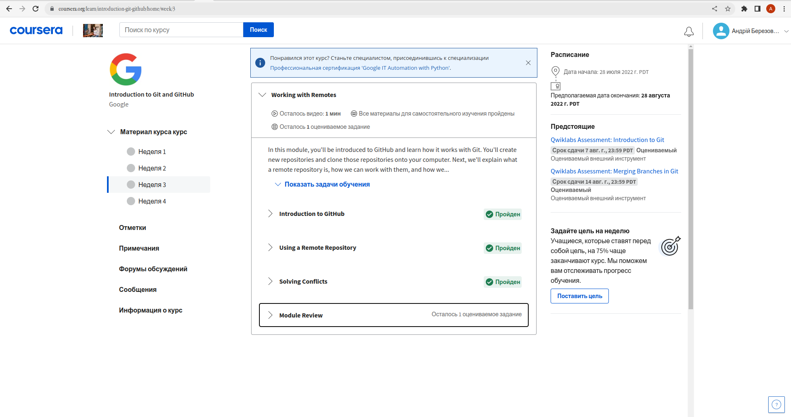

 
Week 4

 
 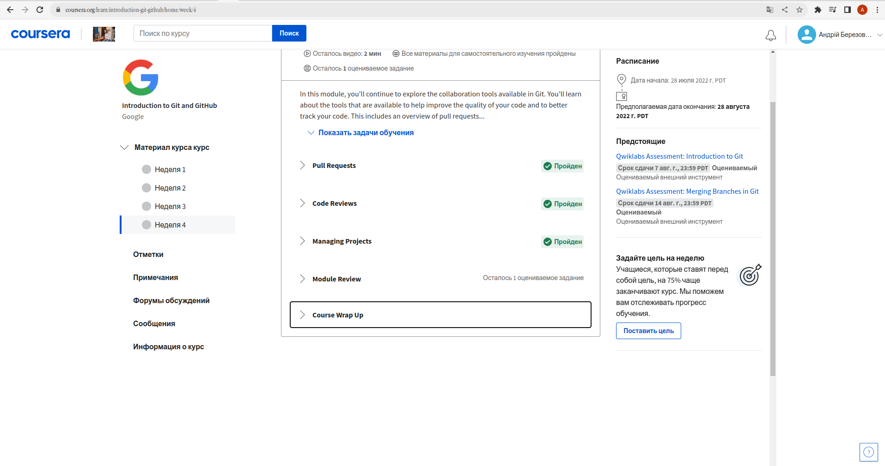

>Although I don't like the coursera platform, the material presented for this topic is quite structured and useful. I learned a lot of new things and will probably use some of them myself, because it is convenient. For example, the `git commit -a -m "message..."` command allows you to immediately add an index and write a message instead of two separate commands `git add .` and `git commit -m "message..."`

 
Basic git

 
 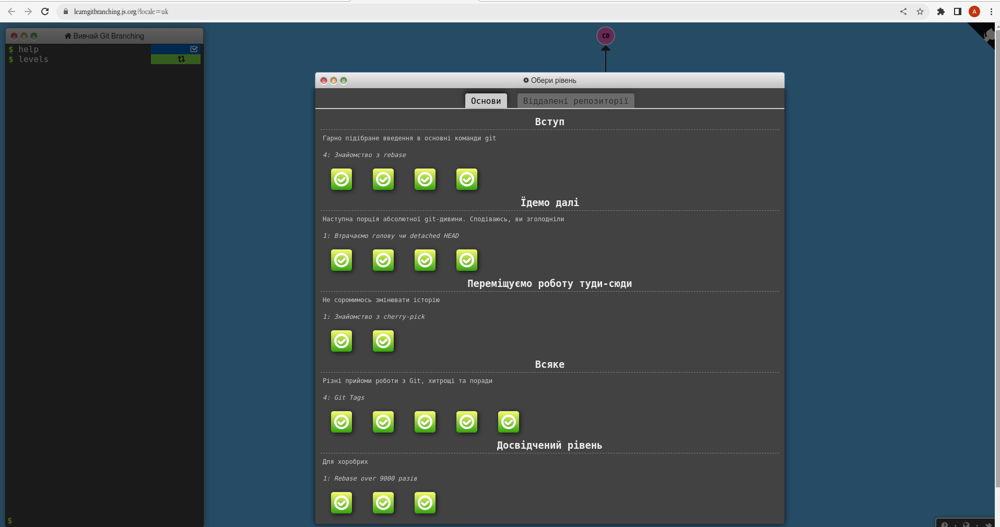

 
Remote git

 
 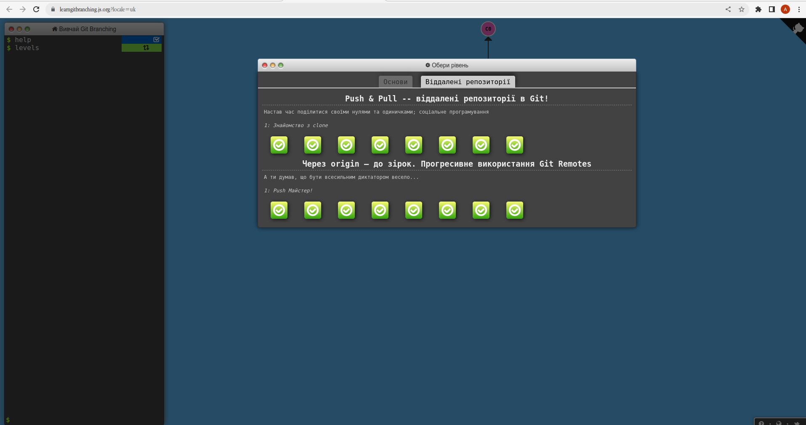

>I really disliked this interactive git game. Very confusing commands, invented in places, as well as commands that are rarely needed, especially at the beginning. I wouldn't recommend this site as a way to get started with `git`, there are better resources, the same youtube videos or different articles.

## Intro to HTML and CSS

 
Week 1

 
 

 
Week 2

 
 

>Since I have a basic `HTML` and `CSS` background, this stuff didn't teach me much. But it was quite interesting to listen to some moments, for example, from the history of its origin, and I also want to highlight well-structured material.

 
Learn HTML and CSS

 
 

>Pretty basic study but very cool structured and organized. I think for beginners this resource will be one of the best for gradually learning `HTML` and `CSS`.

## Responsive Web Design
>The article about adaptive was not new, but it reminded me of some points. It is concisely and informatively written.
>
>Although the video about flex is not new to me, it is presented in a very interesting and structured way. I like this YouTube channel, I have learned a lot from it before.

 
Flexbox Froggy

 
 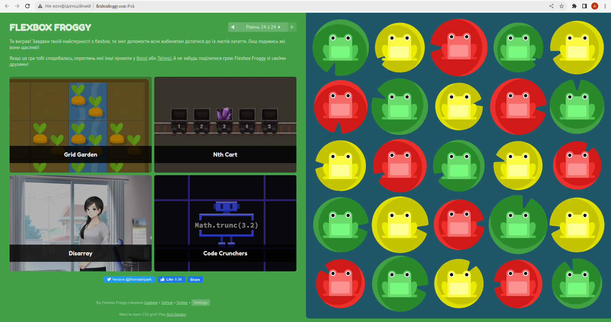

>I like this game, quite intuitive with useful information. Since I have mastered the knowledge of flex well, it was not difficult to pass it.

>I don't use grids, so the information presented in video format was somewhat new and useful to me. But still, I believe that at the moment everything that can be done on grids can also be done on flexes. Grids are quite specific, they have many features, so you have to be very careful when using them.

 
Grid Garden

 
 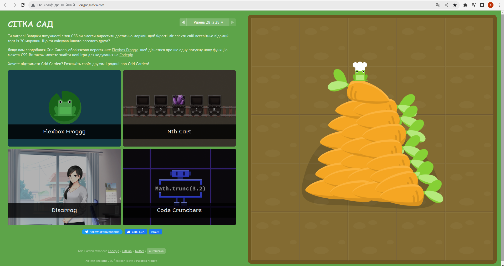

>Since, as I mentioned above, I don't use grids, that's why the passage of the game made me think. But thanks to the information provided earlier, I passed this game with benefit for myself.

## Hooli-style Popup
[Demo](https://berezovskiy-andriy.github.io/kottans-frontend/task_html_css_popup/)

>Interesting and creative for every task. At first glance, it is an easy task, but in the process of work there were sometimes small problems. But in the end it turned out not bad, I'm satisfied)

## JS Basics

 
Week 4

 
 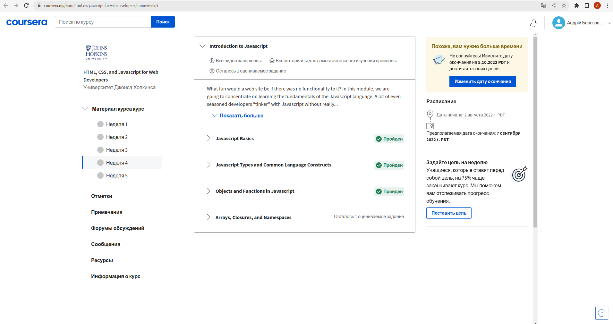

>The information presented here is not new to me, so just reminded myself of some JS points

 
Basic JavaScript

 
 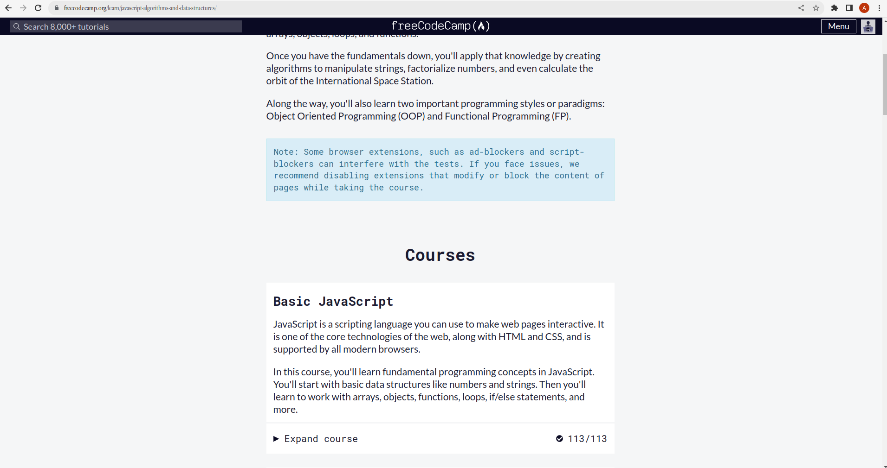

 
ES6 Challenges

 
 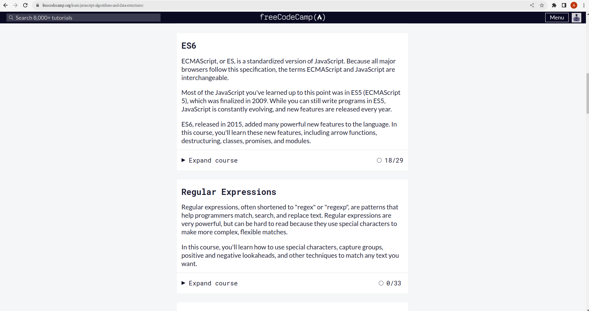

 
Basic Data Structures, Basic Algorithm Scripting

 
 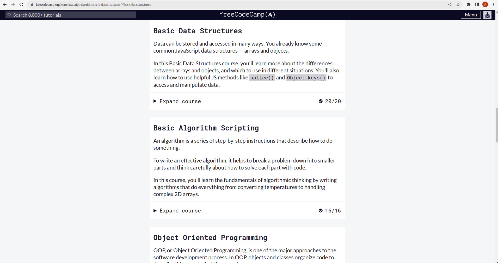

 
Functional Programming, Algorithm Scripting Challenges

 
 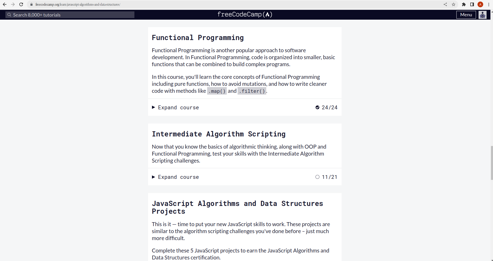

>A lot of interesting information about JS, I especially liked the tasks from the "Basic Algorithm Scripting" section, although there are some topics that are not very clear. But everything can be learned in practice, so this theory will definitely not be superfluous.

