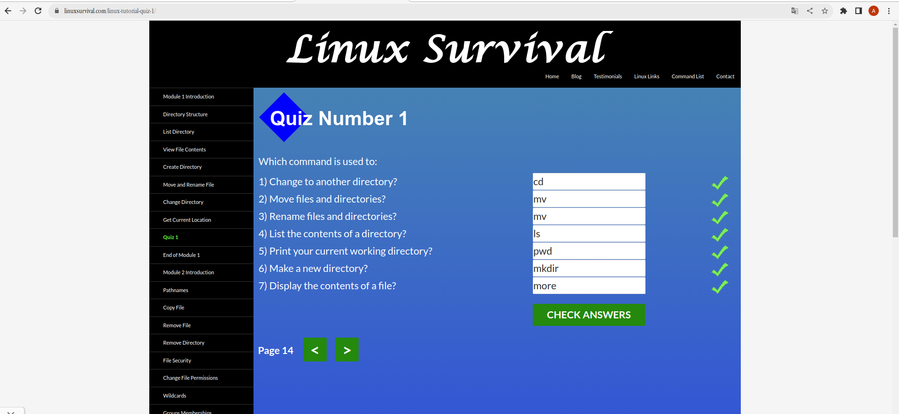
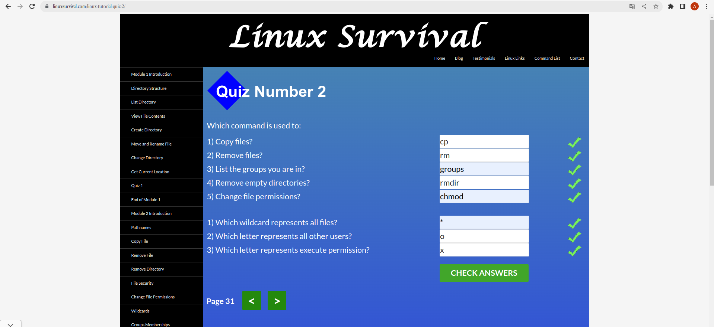
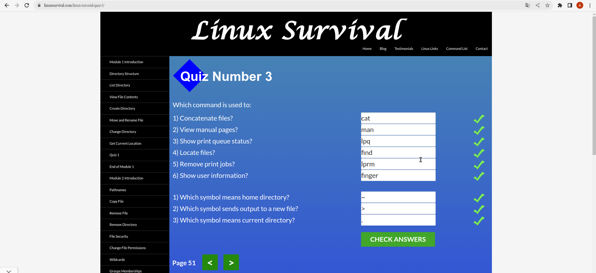
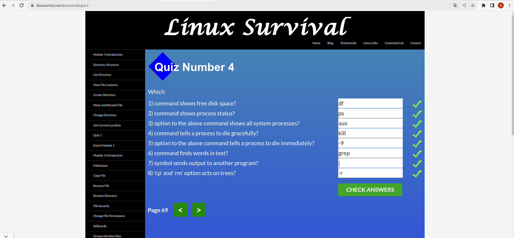

# HELLOOOOOOO!!!

My name is **Andriy**! I am very glad that I can learn programming with you all.\
I have the following programming skills:
* HTML, CSS, SCSS
* JavaScript
* React
* Node JS: Express and Nest JS (basic)
* MySQL, Postgress, Mongo DB (basic)

## Git та GitHub
>In this part of the software lesson, I learned a lot of interesting and useful new things for myself.
>For example, I learned about **`diff`** and **`patch`**, which I hadn't used before. There is also an interactive game about **`git`** that is quite educational, allowing you to learn about the *VSC* ecosystem in a simple yet insightful way.
>
>But learning on Coursera is very boring and doesn't really cover everything in my opinion. There are much more interesting and useful materials on other resources on the Internet.
>
>Although the game is quite high-quality and interestingly made, I am convinced that this method of learning is more confusing, because in combat realities everything is much different

## Linux CLI, and HTTP

 
Quiz 1

 

 
Quiz 2

 

 
Quiz 3

 

 
Quiz 4

 

>A very interestingly designed program for Linux teams in [Linux Survival](https://linuxsurvival.com/linux-tutorial-introduction/). But in my opinion, many things are underused and need more for some sysadmins. 
>In any case, the information was new to me and quite useful in places.
>
>Articles about HHTP protocols that are provided for review are, in my opinion, very difficult to understand and I do not consider them correct at the beginning for a programmer. So you need to know about this protocol, but not in this form, for example, a video would be more visual. 
>About 30% of the information a beginner programmer needs here. Therefore, I had to look for the video myself and understand a little more about this topic
